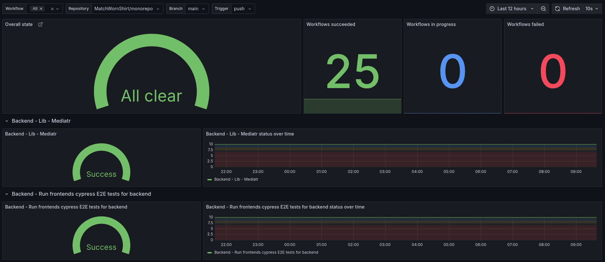

# GitHub Actions Exporter



## Overview

The GitHub Actions Exporter is a service designed to collect and expose metrics about GitHub Actions workflows and jobs for monitoring with Prometheus. This project focuses on implementing the Webhook Receiver component, which processes incoming GitHub webhook events.

## Project Structure

```
gh-actions-exporter
├── cmd
│   └── gh-actions-exporter
│       └── main.go          # Entry point of the application
|
├── internal
│   ├── handlers
│   │   └── webhook.go      # Webhook receiver implementation
|   |
│   ├── metrics
│   │   └── processor.go    # main implementation for the metrics processor
│   │   └── exposer.go      # expose metrics at /metrics
|   |
│   └── server
│       └── server.go       # HTTP server setup and routing
|
├── .gitignore               # Files and directories to ignore by Git
├── go.mod                   # Module definition and dependencies
├── go.sum                   # Checksums for module dependencies
├── README.md                # Project documentation
└── Taskfile.yml             # Tasks for building, testing, and running the application
```

## Getting Started

### Prerequisites

- Go 1.21 or newer
- Docker (optional, for containerization)

### Installation

1. Clone the repository:
   ```
   git clone <repository-url>
   cd gh-actions-exporter
   ```

2. Install dependencies:
   ```
   go mod tidy
   ```

### Running the Application

#### Environment Variables

- `PORT`: The port the server will listen on (default: `:8080`)
- `GITHUB_WEBHOOK_SECRET`: The secret token for verifying GitHub webhook signatures (optional but recommended for production)

To run the application, execute the following command:
```
go run cmd/gh-actions-exporter/main.go
```

The application will start an HTTP server that listens for GitHub webhook events.

#### Security

When `GITHUB_WEBHOOK_SECRET` is set, the application will verify the HMAC signature of incoming webhooks using the `X-Hub-Signature-256` header. This ensures that webhooks are genuinely from GitHub and haven't been tampered with.

If no secret is configured, signature verification is skipped (not recommended for production use).

### Logging

The Webhook Receiver will log the full payloads of incoming webhook events to stdout for monitoring and debugging purposes.

### Metrics

The exporter collects and exposes the following Prometheus metrics:

#### github_workflow_status

Status of GitHub workflow runs with the following labels:
- `repository`: The repository full name (e.g., "owner/repo")
- `workflow`: The name of the workflow
- `branch`: The branch name or tag name
- `trigger`: The event that triggered the workflow (e.g., "push", "pull_request", "schedule", etc.)
- `ref_type`: Indicates whether the workflow was triggered by a "branch" or a "tag"

Values:
- 0 = in_progress
- 1 = success
- 2 = failure
- 3 = timed_out
- 4 = startup_failure
- 5 = cancelled
- 6 = skipped
- 7 = neutral
- 8 = action_required
- 9 = stale
- 10 = null

Example Prometheus queries:
```
# Filter by branch
github_workflow_status{branch="main",ref_type="branch"}

# Filter by tag (release workflow)
github_workflow_status{ref_type="tag",trigger="push"}

# Filter by specific tag pattern
github_workflow_status{branch=~"v.*",ref_type="tag"}
```

## Contributing

Contributions are welcome! Please open an issue or submit a pull request for any enhancements or bug fixes.

### License

MIT license

### Support

@jdunnink