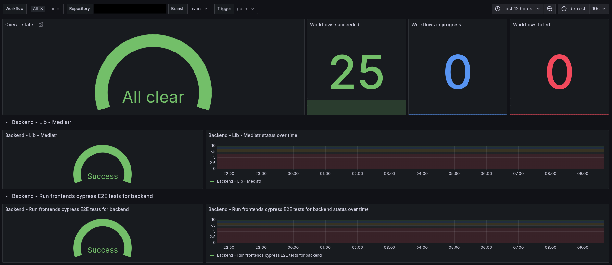

# GitHub Actions Exporter



## Overview

The GitHub Actions Exporter is a service designed to collect and expose metrics about GitHub Actions workflows for monitoring with Prometheus.

## Getting Started

### Prerequisites

- Go 1.21 or newer
- Docker (optional, for containerization)

### Installation

1. Clone the repository:
   ```bash
   git clone https://github.com/Replaid-inc/github-actions-exporter.git
   cd github-actions-exporter
   ```

2. Install dependencies:
   ```bash
   go mod tidy
   ```

3. Build the application:
   ```bash
   go build -o github-actions-exporter cmd/gh-actions-exporter/main.go
   ```

### Configuration

The application can be configured using environment variables:

| Variable | Description | Default | Required |
|----------|-------------|---------|----------|
| `PORT` | The port the server will listen on | `:8080` | No |
| `GITHUB_WEBHOOK_SECRET` | Secret token for verifying GitHub webhook signatures | None | Recommended for production |

### Webhook Setup

To set up GitHub webhooks for your repositories:

1. Go to your repository's Settings > Webhooks
2. Click "Add webhook"
3. Set the Payload URL to `https://your-domain.com/webhook`
4. Set Content type to `application/json`
5. Select "Let me select individual events" and choose:
   - Workflow runs
   - Workflow jobs (optional)
6. Add your webhook secret (should match `GITHUB_WEBHOOK_SECRET`)
7. Click "Add webhook"

### Running the Application

#### Environment Variables

- `PORT`: The port the server will listen on (default: `:8080`)
- `GITHUB_WEBHOOK_SECRET`: The secret token for verifying GitHub webhook signatures (optional but recommended for production)

To run the application, execute the following command:
```bash
# Run directly with Go
go run cmd/gh-actions-exporter/main.go

# Or run the built binary
./github-actions-exporter
```

#### Using Docker

You can also run the application using Docker:

```bash
# Build the Docker image
docker build -t github-actions-exporter .

# Run the container
docker run -p 8080:8080 \
  -e GITHUB_WEBHOOK_SECRET=your-secret \
  github-actions-exporter
```

#### Using Kubernetes with Helm

Deploy to Kubernetes using the provided Helm chart:

```bash
# Add the repository (replace with your actual Helm repository)
helm repo add github-actions-exporter https://Replaid-inc.github.io/github-actions-exporter

# Install the chart
helm install github-actions-exporter github-actions-exporter/github-actions-exporter \
  --set image.repository=your-registry/github-actions-exporter \
  --set image.tag=latest \
  --set env.GITHUB_WEBHOOK_SECRET=your-webhook-secret
```

The application will start an HTTP server that listens for GitHub webhook events at `/webhook` and exposes Prometheus metrics at `/metrics`.

#### Security

When `GITHUB_WEBHOOK_SECRET` is set, the application will verify the HMAC signature of incoming webhooks using the `X-Hub-Signature-256` header. This ensures that webhooks are genuinely from GitHub and haven't been tampered with.

If no secret is configured, signature verification is skipped (not recommended for production use).

#### github_workflow_status

Status of GitHub workflow runs with the following labels:
- `repository`: The repository full name (e.g., "owner/repo")
- `workflow`: The name of the workflow
- `branch`: The branch name or tag name
- `trigger`: The event that triggered the workflow (e.g., "push", "pull_request", "schedule", etc.)
- `ref_type`: Indicates whether the workflow was triggered by a "branch" or a "tag"

Values:
- 0 = in_progress
- 1 = success
- 2 = failure
- 3 = timed_out
- 4 = startup_failure
- 5 = cancelled
- 6 = skipped
- 7 = neutral
- 8 = action_required
- 9 = stale
- 10 = null

Example Prometheus queries:
```
# Filter by branch
github_workflow_status{branch="main",ref_type="branch"}

# Filter by tag (release workflow)
github_workflow_status{ref_type="tag",trigger="push"}

# Filter by specific tag pattern
github_workflow_status{branch=~"v.*",ref_type="tag"}
```

## Contributing

We welcome contributions! Please see our [Contributing Guidelines](CONTRIBUTING.md) for details on how to submit pull requests, report issues, and contribute to the project.

### Development

For local development:

1. Fork the repository
2. Create a feature branch: `git checkout -b feature/your-feature`
3. Make your changes and add tests
4. Run tests: `go test ./...`
5. Run linting: `golangci-lint run`
6. Commit your changes: `git commit -am 'Add some feature'`
7. Push to the branch: `git push origin feature/your-feature`
8. Submit a pull request

## License

This project is licensed under the MIT License - see the [LICENSE](LICENSE) file for details.

## Support

- Create an [issue](https://github.com/Replaid-inc/github-actions-exporter/issues) for bug reports or feature requests
- Contact: @jdunnink

## Monitoring Dashboard

The repository includes a Grafana dashboard (`dashboards/state-of-ci.json`) that provides visualization of your GitHub Actions metrics.